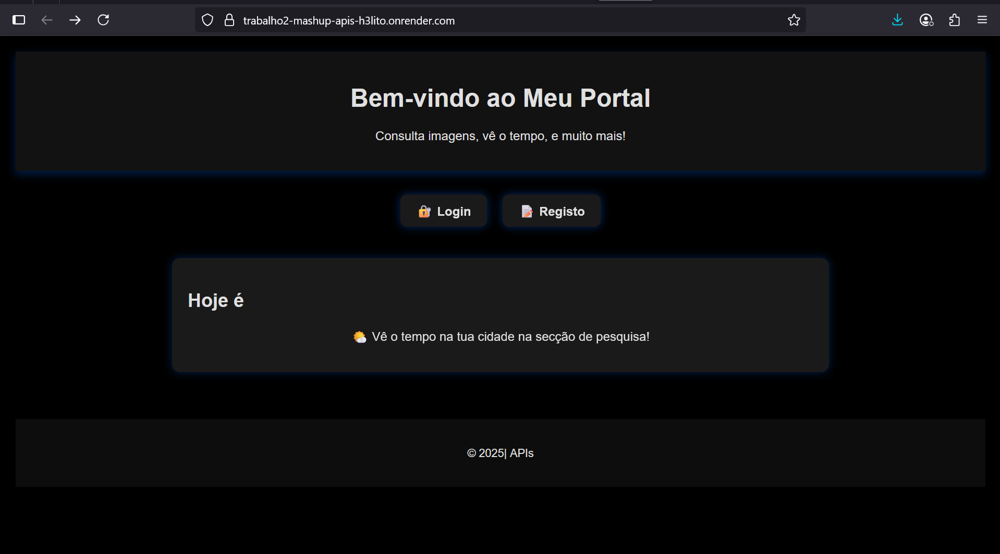
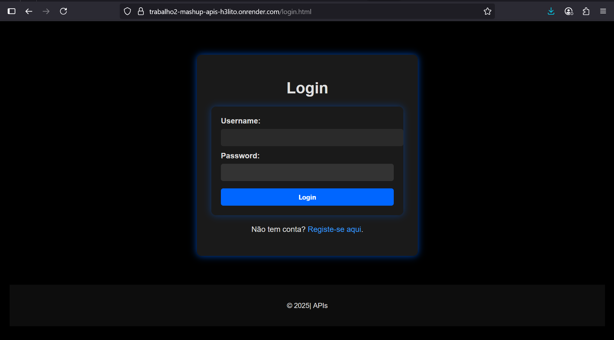
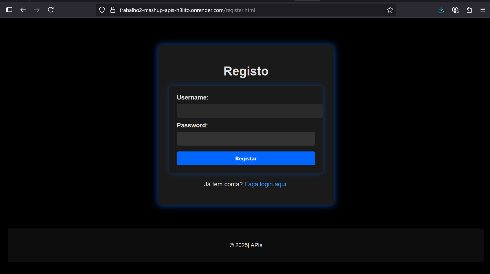
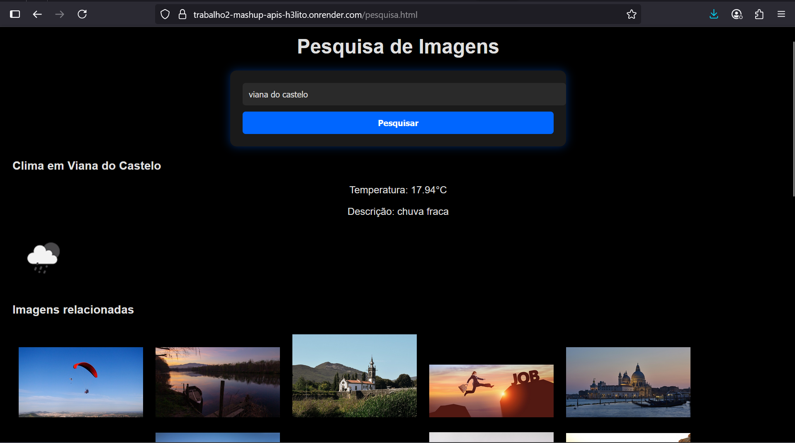

# Projeto de Pesquisa de Imagens com Autenticação

**Aluno:** Hélito de Jesus Mendes de Horta 
**Número:** 32440 
**Curso:** Engenharia de Redes e Sistemas de Computadores  
---
## Ferramentas utilizadas

- Node.js
- MongoDB
- API Pixabay (Pesquisa de imagens)
- OpenWeatherMap API (dados meteorológicos)
- doten
- bcrypt 
- express-session
- HTML
- CSS
- JavaScript
---
## Instalação e Configuração

### Pré-requisitos

- Node.js instalado ([https://nodejs.org](https://nodejs.org))
- MongoDB Atlas ou MongoDB local instalado e configurado ([https://www.mongodb.com](https://www.mongodb.com))
- Conta e API Key da Pixabay ([https://pixabay.com/api/docs/](https://pixabay.com/api/docs/))
---
### Passos

1. Clone  repositório:
   
   git clone https://github.com/teu-usuario/teu-repositorio.git
   cd repositorio
---

2. Instalar dependencias

`npm install`

3. Criar o ficheiro `.env` na raiz com as variáveis:
   
   `SECRET_KEY=sua_chave_secreta_aqui
   MONGODB_URI=sua_uri_mongodb_aqui
   PIXABAYKEY=sua_api_key_pixabay_aqui`
   
4. Configurar MongoDB: Criar as coleções `users` e `historico_pesquisa` na base de dados.
      - Executar localmente
              `node server.js`
      A aplicação estará disponível em: `http://localhost:3000`
---
## Demonstração execução do sistema
> Ao abrir a página inicial é apresentado as opções de login e registo.
> Ao fazer o login pode pesquisar por uma Cidade; De seguida é apresentado o resultado.
> Como está lidando com dois APIs, é apresentado a temperatura da Cidade e em baixo imagens encontradas.
> Se não tiver uma conta, pode criar um novo utilizador e de seguida fazer o login.

---
URL
- Render:  https://trabalho2-mashup-apis-h3lito.onrender.com
---
#### Atenção: Como o backend está em deploy gratuito e sofre de cold start (demora para iniciar após inatividade), entrando em hibernação após alguns minutos sem uso, optei por utilizar o Uptime Robot( https://uptimerobot.com/). Este serviço envia pings regulares ao backend a cada X minutos para mantê-lo ativo.
